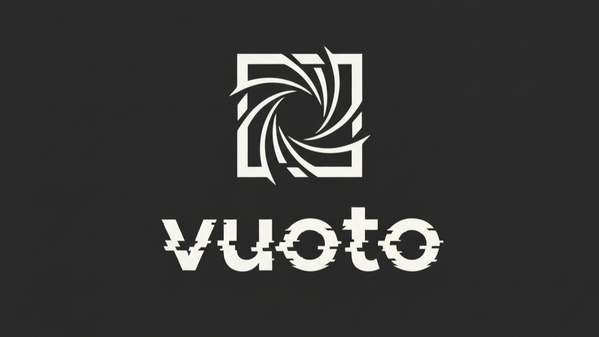

<p align="center">
  
</p>

# vuoto

> cut the noise, clean the void—normalize your whitespace

`vuoto` is a modern whitespace normalizer and ESLint plugin designed to detect and fix invisible, ambiguous, or problematic Unicode whitespace characters that can cause issues in codebases, data processing, and terminal output.

## Features

- 🎯 **Whitespace Normalization**: Detects and fixes 13+ types of problematic characters (Zero-width, NBSP, BOM, etc.)
- 🚀 **ESLint Plugin**: Includes `eslint-plugin-vuoto` for real-time linting and auto-fixing.
- 🌈 **Beautiful CLI**: Enhanced terminal output with progress tracking and detailed reporting.
- ⚡ **Turbo Powered**: Built as a monorepo for maximum performance and reliability.
- 🔧 **Highly Configurable**: Supports `.vuotoignore` for custom exclusions.

## Packages

| Package | Description | Version |
| ------- | ----------- | ------- |
| [`vuoto`](./packages/vuoto) | Core CLI and normalization engine | [](https://www.npmjs.com/package/vuoto) |
| [`eslint-plugin-vuoto`](./packages/eslint-plugin-vuoto) | ESLint rules for whitespace normalization | [](https://www.npmjs.com/package/eslint-plugin-vuoto) |

## Quick Start

### CLI

```bash
npx vuoto --fix
```

### ESLint

```javascript
// eslint.config.js
import vuoto from 'eslint-plugin-vuoto';

export default [
  ...vuoto.configs.recommended,
];
```

## What it Normalizes

- ✓ **Zero-width characters**: ZWSP, ZWNJ, ZWJ, ZWNBSP
- ✓ **Invisible separators**: Word Joiner, BOM
- ✓ **Non-breaking spaces**: NBSP, NNBSP
- ✓ **Legacy controls**: Form Feed, Vertical Tab
- ✓ **Unicode separators**: Line/Paragraph separators (U+2028, U+2029)
- ✓ **Wide spaces**: Em/En spaces, Ideographic space

## License

This project is licensed under the MIT License.

**Copyright (c) 2026 Davide Di Criscito**

For the full details, see the [LICENSE](LICENSE) file.
